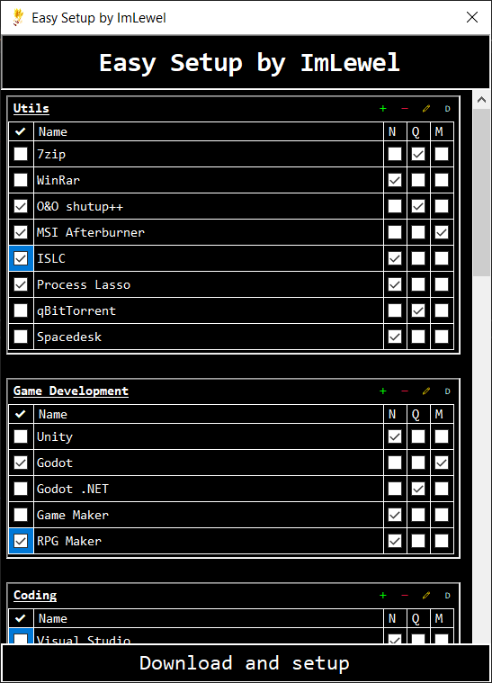

# Easy Setup by ImLewel
## Very useful and simple application for those who are tired of searching for required apps after factory reset your system or any other ocasions
## Current functionality:
- Selection of neccessary applications you want to install
- Auto download and launching of setup process
- If you want to add some app to certain category, currently you can manage database (will be changed with future updates)
- Install options selection
- Add the possibility to manage app templates, easily add/remove app, category, etc. (Almost done)
## Some images of current project appearance

## Future plans
- Load and store templates
- Add more QoL features
- Add helpful context menus and toolstrips
- Add logs
- Haven't made it up here
